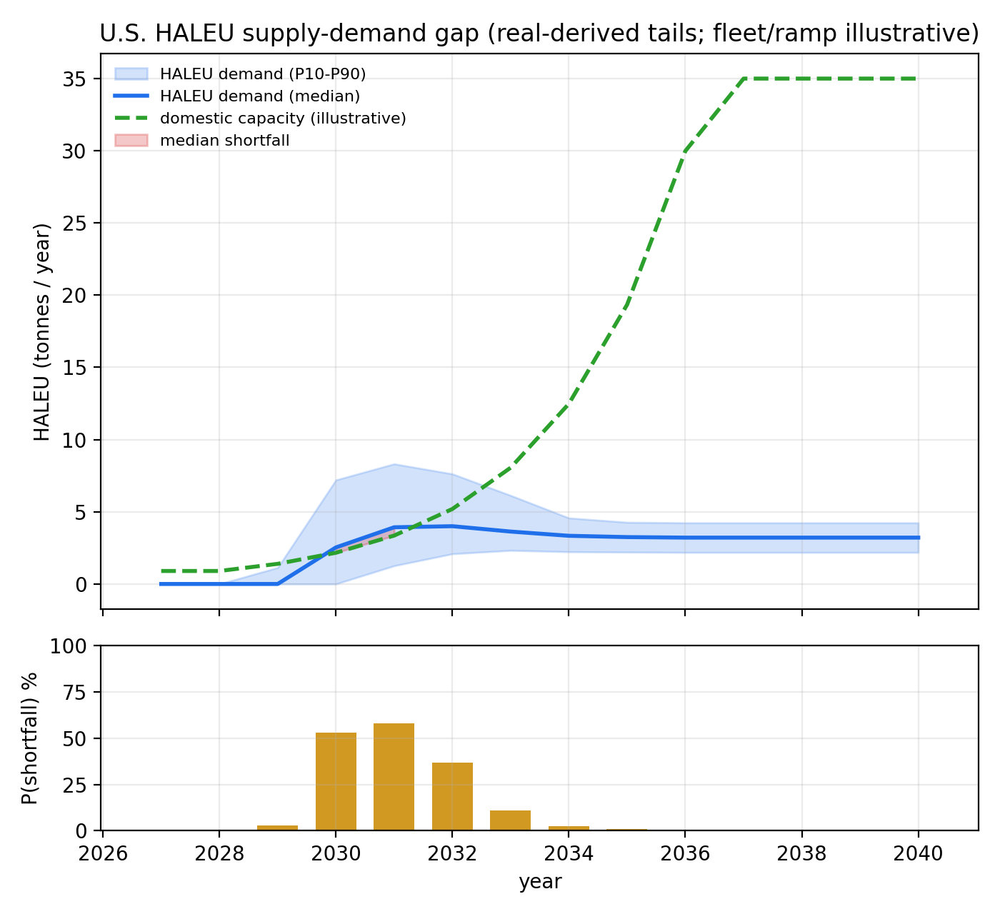
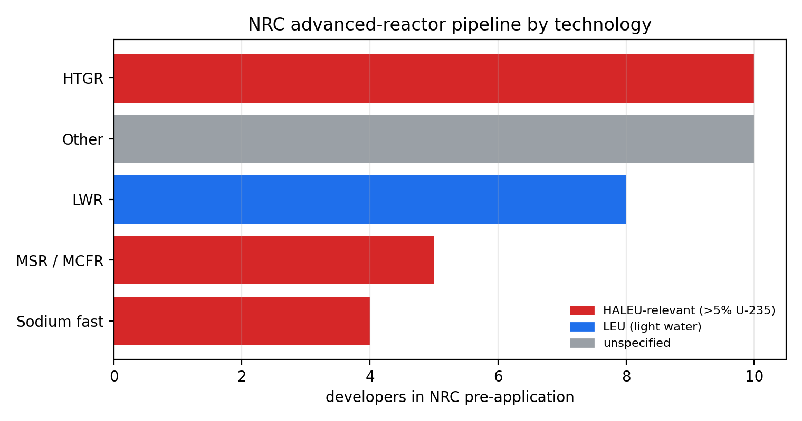
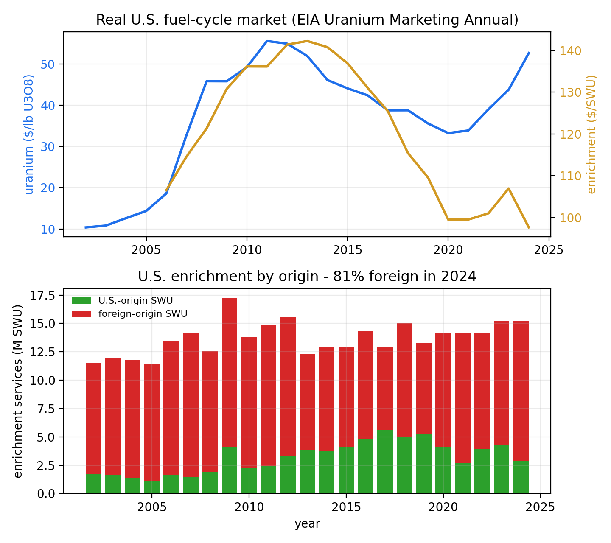
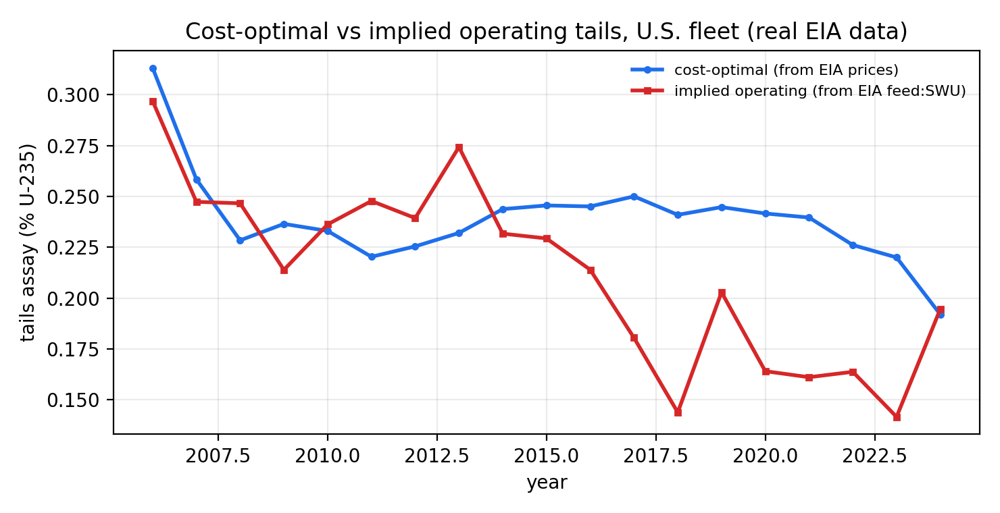
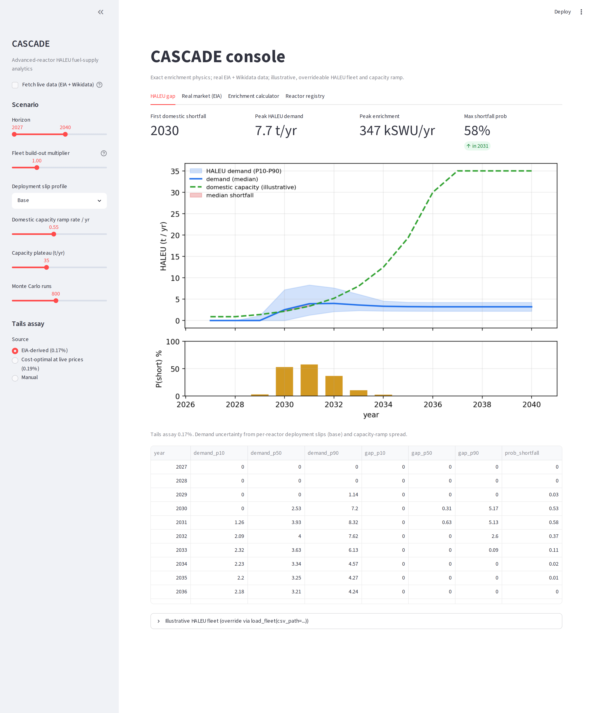

# CASCADE: Advanced-Reactor HALEU Fuel-Supply Analytics

CASCADE models the **high-assay low-enriched uranium (HALEU)** supply chain for
the U.S. advanced-reactor build-out: how much enriched fuel the deployment
pipeline needs, how fast domestic enrichment capacity can ramp, and where the
gap falls. It pairs a rigorous, textbook-correct enrichment-physics core with a
Monte Carlo supply-demand model.

It is the fuel-cycle companion to
[STRATA](https://github.com/Dr-pm-dav/strata-platform) (critical-mineral and
energy-siting analytics): STRATA covers the resource and siting end of energy
security; CASCADE covers the nuclear-fuel end.

**Scope:** civilian LEU/HALEU only, with product assays up to 20% U-235. The
enrichment module refuses anything above that. CASCADE models fuel-supply
economics and throughput (feed, tails, separative work), not separation
technology.



## Why this matters

Every U.S. advanced reactor in the current pipeline (sodium fast reactors,
high-temperature gas reactors, salt reactors, microreactors) runs on HALEU, and
HALEU is far more separative-work-intensive than the ~5% LEU used in today's
light-water fleet. Domestic enrichment capacity is only beginning to ramp under
the DOE HALEU Availability Program, so the timing question, *does supply arrive
before the reactors do?*, is a live national-energy-security problem. CASCADE
puts numbers and uncertainty bands on it.

## The enrichment core (exact)

The `enrichment` module implements the standard ideal-cascade relations. The
separation potential (value function) is

```
V(x) = (2x − 1) · ln( x / (1 − x) )
```

and the mass balance for producing product at assay `xp` from feed `xf` with
tails `xw` is

```
feed/product  = (xp − xw) / (xf − xw)
tails/product = (xp − xf) / (xf − xw)
SWU/product   = V(xp) + (tails/product)·V(xw) − (feed/product)·V(xf)
```

These are verified against the textbook reference point (4.4% LEU at 0.25%
tails needs ~6.7 SWU/kg), and the model reproduces ~41 SWU/kg for 19.75% HALEU,
which is why HALEU is the binding constraint.

## Pipeline

| Module | Role |
| --- | --- |
| `enrichment` | Value function, feed/tails/SWU factors, `enrichment_requirements` |
| `reactors` | Reference advanced-reactor fleet (HALEU assay, core + reload masses, year) |
| `demand` | Annual HALEU (tonnes) and SWU (kSWU) demand from the fleet |
| `supply` | Domestic HALEU enrichment-capacity ramp |
| `gap` | Deterministic and Monte Carlo supply-demand gap |
| `connectors` | Real EIA market data + Wikidata and NRC reactor registries / pipeline (live, cached, with committed snapshots) |
| `tails` | Tails-assay economics: cost-optimal tails, cost breakdown, historical optimal-vs-actual |

The Monte Carlo samples the two dominant uncertainties, per-reactor deployment
slips and the pace of the domestic capacity ramp, then reports the unmet-HALEU
band and the probability of shortfall by year.

## Real data connectors

`run_real.py` pulls live, credential-free data and grounds the model in it.

**EIA Uranium Marketing Annual** (U.S. EIA, Form EIA-858) provides real uranium
price, enrichment services purchased (SWU) with U.S./foreign split, the average
$/SWU price, and feed deliveries. **Wikidata SPARQL** provides the real
operating-reactor registry (names, countries, capacities). Both are fetched
live, cached, and backed by committed snapshots in `cascade/data/` so the repo
runs offline.

**NRC reactor data** (U.S. NRC website, no API key) adds two real datasets: the
licensed operating fleet (95 units, the light-water LEU base) and the
advanced-reactor pre-application pipeline grouped by technology. Of 37 pipeline
developers, 19 sit in the HALEU-relevant technologies (high-temperature gas,
molten-salt, and sodium-cooled fast designs), which is the forward demand side
the gap model represents. The IAEA PRIS database is the natural global source
but blocks automated clients (HTTP 503), so global fleet context comes from
Wikidata, whose reactor records draw on IAEA / PRIS data.





The real data also independently **validates the enrichment engine**. EIA
reports the U.S. fleet's feed deliveries and SWU purchased; their five-year
ratio is 0.944 kg U per SWU. Given a representative 4.5% product assay, the
engine reproduces that ratio at a **0.17% tails assay**, and the cost-optimal
tails at the real 2024 uranium and SWU prices is **0.19%**. Actual operations
sitting at or below the cost-optimal point is the industry's well-documented
*underfeeding* under high uranium prices, and the engine recovers it from first
principles. (This is an approximate aggregate cross-check: feed-delivery versus
SWU-purchase timing and the ~81% foreign-origin enrichment make it
assay-sensitive, not an exact inversion.)

Every run also writes `outputs/cascade_provenance.json` listing each source,
its URL, the fetch time, and exactly which fields are real versus modelled.

### Tails-assay economics over 20 years

The tails assay is the central economic lever in enrichment, and the
`tails` module turns the real EIA price history into a question: did U.S.
operators track the cost-optimal tails? The cost-optimal tails (from EIA's
uranium and SWU prices) and the implied operating tails (from EIA's feed and
SWU quantities) both fell from about 0.31% in the mid-2000s toward 0.19% in
2024 as uranium grew expensive relative to separative work. They tracked each
other into the mid-2010s, then operations ran below the optimum through the
late 2010s, the aggressive *underfeeding* era, before reconverging.



The cost-optimal tails is nearly independent of product assay (it is set by the
feed assay and the price ratio). The implied operating series is an indicator
only: feed-delivery versus SWU-purchase timing, the ~81% foreign-origin
enrichment, and an assumed 4.5% product assay all blur it.

## Honesty contract

- **The enrichment physics is exact:** standard separative-work relations,
  unit-tested against the known 4.4% / 0.25%-tails reference.
- **The market data and reactor registries are real:** EIA Form EIA-858, the
  Wikidata SPARQL endpoint, and the NRC operating-fleet and advanced-reactor
  pipeline pages, fetched live with committed snapshots and full provenance. The
  HALEU-relevance flag on the NRC pipeline is CASCADE's own technology-to-fuel
  mapping, not an NRC statement.
- **The fleet HALEU loadings and capacity ramp are illustrative placeholders**
  at public order-of-magnitude only. Per-reactor HALEU loadings and the domestic
  ramp are not published as data; the values here exist so the model runs.
  Replace them with vetted inputs via the CSV overrides
  (`load_fleet(csv_path=...)`, `capacity_curve(csv_path=...)`) before citing any
  result.
- **Civilian scope is enforced in code:** `enrichment_requirements` raises above
  20% U-235.

## The dashboard

`streamlit run app/streamlit_app.py` opens a scenario console: the HALEU gap
under adjustable deployment, capacity, and tails assumptions; the real EIA
market view with the engine validation; tails economics; an enrichment calculator; and the live
reactor registry.



## Quickstart

```bash
pip install -r requirements.txt
python demo.py          # synthetic-fleet console report + outputs/cascade_gap.png
python run_real.py      # LIVE: pull EIA + Wikidata + NRC, validate engine, run gap
python run_real.py --offline       # same, from committed real-data snapshots
streamlit run app/streamlit_app.py # interactive scenario dashboard
pytest -q               # 24 tests: physics, pipeline, connector, and tails contracts
```

```python
import cascade as C
C.enrichment.enrichment_requirements(product_kg=1000, xp=0.1975)
# -> feed_kg, tails_kg, swu, factors  (1 t of 19.75% HALEU)

mc = C.gap.monte_carlo_gap(start_year=2027, end_year=2040, plateau=35)
mc[["year", "gap_p50", "prob_shortfall"]]
```

## Next steps

- Enrich the NRC advanced-reactor pipeline with per-design fuel data (HALEU
  enrichment and core loading) as DOE-NE / IAEA ARIS publish it, replacing the
  modelled loadings with vetted per-reactor inputs.

## License

MIT license. (c) 2026 Stefani D. W. Yates
